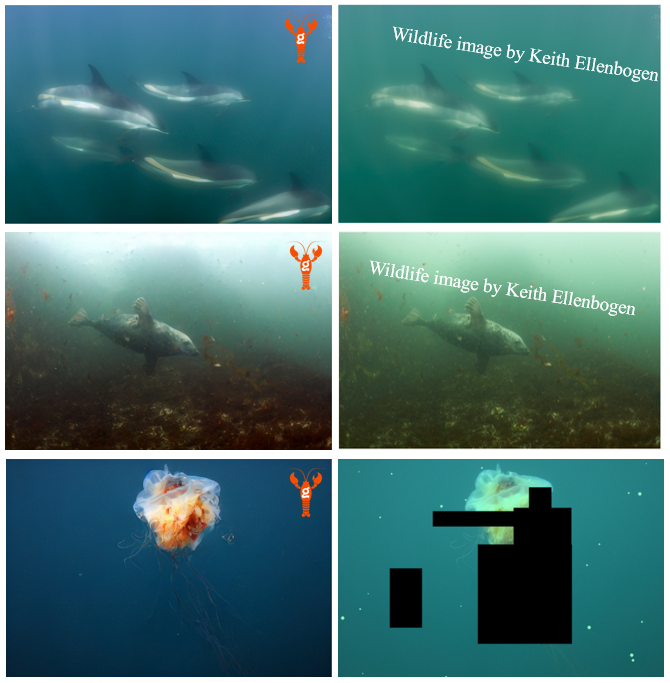

# LOBSTgER-enhance

Official pytorch implementation of LOBSTgER-enhance: an image-to-image latent diffusion model for underwater image restoration and enhancement. LOBSTgER-enhance is part of the LOBSTgER (Learning Oceanic Bioecological Systems Through gEnerative Representations) project, led by Andreas Mentzelopoulos, PhD (ML) & Keith Ellenbogen (data collection/field photography).



Publication: TBD

## Overview

Implementation of an underwater image-enhancement pipeline leveraging diffusion-based generation in the latent space of a pre-trained VAE. The model operates in the latent space of "Stable Diffusion"'s VQ-GAN, enabling efficient training and inference. The implementation includes (from a technical standpoint):

- **Latent Diffusion**: Training in a compressed latent space for efficiency
- **Velocity Parameterization**: Optimization based on "v-prediction" for improved training stability
- **Classifier-Free Guidance**: For generation guidance, and possibly unconditional generation (if you have enough data).
- **DDPM & DDIM Sampling**: Both full and fast sampling modes
- **Conditional Generation**: Image-to-image restoration from corrupted inputs

## Features

- ✅ Flexible image dimensions (H, W)
- ✅ Latent space diffusion (8x compression)
- ✅ Velocity parameterization (v-prediction)
- ✅ Classifier-free guidance for conditional generation
- ✅ DDPM and DDIM sampling modes
- ✅ Mixed precision training (AMP)
- ✅ Exponential Moving Average (EMA) for model weights
- ✅ Automatic checkpointing and resume capability
- ✅ Dynamic dataloader refresh for data augmentation
- ✅ Custom learning rate scheduler with warmup
- ✅ Comprehensive logging and visualization

## Installation

### Requirements

- Python 3.8+
- PyTorch 2.0+ (with CUDA support recommended)
- CUDA-capable GPU (recommended for training)

### Dependencies

```bash
pip install torch torchvision
pip install diffusers transformers
pip install tqdm matplotlib pillow numpy
pip install denoising-diffusion-pytorch
```

## Project Structure

```
Latent_UnderWater_Diffusion/
├── train_model.py              # Main training script
├── train_model.ipynb           # Training notebook
├── prep_data.py                # Data preparation script
├── prep_data.ipynb             # Data preparation notebook
├── model_architectures.py      # UNet model definitions
├── helpers/
│   ├── diffusion_utils_conditional.py  # DDPM/DDIM sampling, velocity parameterization
│   ├── train_utils.py          # Training utilities (checkpointing, EMA, schedulers)
│   ├── inference_utils.py      # Inference and generation functions
│   ├── read_data_tools.py      # Data loading and preprocessing
│   ├── artificial_corruption_utils.py  # Underwater corruption simulation
│   ├── pre_trained_autoencoder.py     # VAE loading and encoding/decoding
│   └── plotting_utils.py       # Visualization utilities
├── images/                     # Training data directory
│   ├── Favorites/              # Class folders for images
│   ├── Rest/                   # Class folder for images
│   └── data_checkpoints/       # Preprocessed dataset checkpoints
├── test_images/                # Test images for inference
│   ├── Test_category_1/        # Test set category 1
│   └── Test_category_2/        # Test set category 2
├── model_checkpoints/          # Saved model checkpoints
├── results/                    # Training logs and generated images
└── Inference.ipynb             # Inference notebook
```

## Usage

### Training

#### Basic Training

```bash
python train_model.py
```

#### Custom Training Configuration

```bash
python train_model.py \
    --learning-rate 1e-2 \
    --num-epochs 1000 \
    --batch-size 64 \
    --model-dim 128 \
    --dim-mults 1,2 \
    --total-timesteps 1000 \
    --cfg-dropout 0.25 \
    --ema-decay 0.995 \
    --checkpoint-every 25 \
    --model-name my_model
```

#### Key Training Arguments

| Argument | Default | Description |
|----------|---------|-------------|
| `--learning-rate` | 1e-2 | Learning rate for optimizer |
| `--num-epochs` | 1000 | Number of training epochs |
| `--batch-size` | 64 | Training batch size |
| `--model-dim` | 128 | Base dimension for UNet |
| `--dim-mults` | 1,2 | Dimension multipliers (comma-separated) |
| `--total-timesteps` | 1000 | Number of diffusion timesteps |
| `--cfg-dropout` | 0.25 | Classifier-free guidance dropout rate |
| `--ema-decay` | 0.995 | EMA decay rate |
| `--checkpoint-every` | 25 | Save checkpoint every N epochs |
| `--log-every` | 5 | Log metrics every N epochs |
| `--mixed-precision` | True | Use mixed precision training |
| `--refresh-dataloader` | True | Enable dynamic dataloader refresh |

### Data Preparation

1. **Organize Images**: Place training images in `images/` in the two provided subdirectories. Favorites highest quality images, and Rest all other images:
   ```
   images/
   ├── Favorites/    # Class 0
   └── Rest/         # Class 1
   ```

2. **Preprocess Data** (Do it ONCE only!): Use `prep_data.py` or `prep_data.ipynb` to:
   - Load and preprocess images from `images/` 
   - Encode images to latent space using the VAE
   - Create corrupted/clean pairs for training
   - Save the preprocessed latent dataset to `images/data_checkpoints/`

   Run the script:
   ```bash
   python prep_data.py
   ```
   Optional arguments: `--H` (default 512), `--W` (default 768), `--batch_size` (default 32).

### Inference

#### Using Notebook

See `Inference.ipynb` for interactive inference examples.

## Model Architecture

- **Backbone**: U-Net from `denoising-diffusion-pytorch`
- **Input**: Latent representations and conditions,  (4 channels, 8x downsampled)
- **Conditioning**: Concatenated condition latents (for conditional generation)
- **Output**: Velocity prediction (v-parameterization)

## Training Details

### Loss Function
- **MSE Loss** on velocity predictions: `L = ||v_t - v_pred||²`

### Training Features
- **Mixed Precision**: Automatic mixed precision (AMP) for faster training
- **EMA**: Exponential moving average of model weights
- **Gradient Clipping**: Max norm of 1.0
- **Learning Rate Schedule**: Custom scheduler with warmup and decay
- **Dynamic Data Refresh**: Periodically refreshes augmented data in dataloader

### Checkpointing
- Automatic checkpoint saving every N epochs
- Resume training from last checkpoint
- Saves: model state, optimizer state, scheduler state, EMA parameters, loss history

## Sampling Modes

### DDPM (Full Sampling)
- Deterministic reverse diffusion process
- Uses all timesteps (default: 1000)
- Higher quality, slower

### DDIM (Fast Sampling)
- Deterministic sampling with fewer steps
- Default: 50 steps
- Faster inference, slightly lower quality

## Classifier-Free Guidance

The model supports classifier-free guidance for conditional generation:
- **CFG Scale**: Controls strength of conditioning (default: 2.5-3.0)
- **Dropout**: Randomly sets conditions to null token during training (default: 0.25)

## Results

Training logs and generated images are saved in `results/`:
- `Loss.png`: Training loss curve
- `train_<model_name>_<timestamp>.log`: Detailed training log
- `generated_images/`: Generated samples

## Citation

If you use this code in your research, please cite:

```
@software{latent_underwater_diffusion,
  author = {Mentzelopoulos, Andreas},
  title = {Latent Underwater Diffusion},
  year = {2025},
  institution = {MIT},
  email = {ament@mit.edu}
}
```

## License

Copyright (c) 2025, Andreas Mentzelopoulos. All Rights Reserved.

This code is the exclusive property of Andreas Mentzelopoulos and LOBSTgER.

For permission requests, contact: Andreas Mentzelopoulos, ament@mit.edu.

## Acknowledgments

- Uses VAE from Stable Diffusion (CompVis/stable-diffusion-v1-4)
- U-Net architecture from `denoising-diffusion-pytorch`
- Implementation inspired by DDPM, DDIM, and latent diffusion papers

## Troubleshooting

### Common Issues

1. **CUDA Out of Memory**
   - Reduce `--batch-size`
   - Reduce `--model-dim`
   - Enable `--mixed-precision` (default)

2. **Slow Training**
   - Ensure CUDA is available
   - Use mixed precision training
   - Reduce image resolution in preprocessing

3. **Poor Generation Quality**
   - Train for more epochs
   - Increase model capacity (`--model-dim`, `--dim-mults`)
   - Adjust learning rate
   - Check data quality and preprocessing

## Contact

For questions or issues, contact: ament@mit.edu

